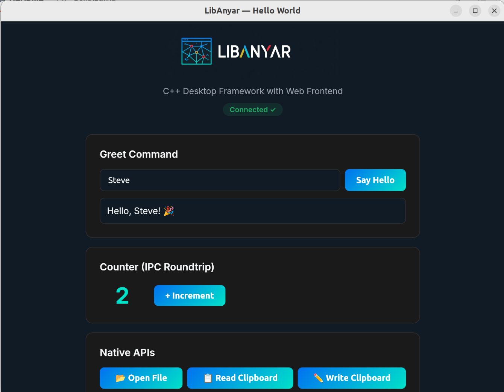
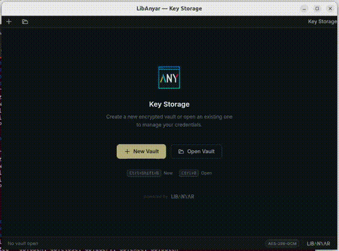
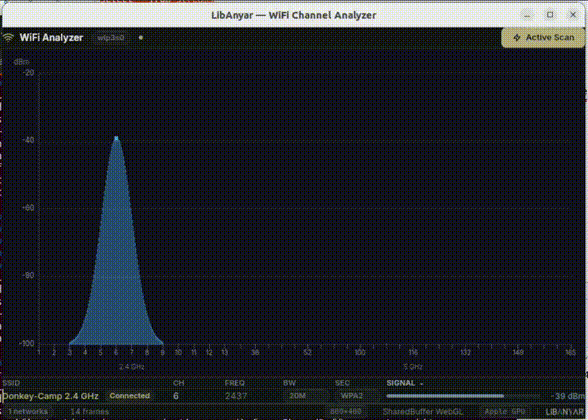
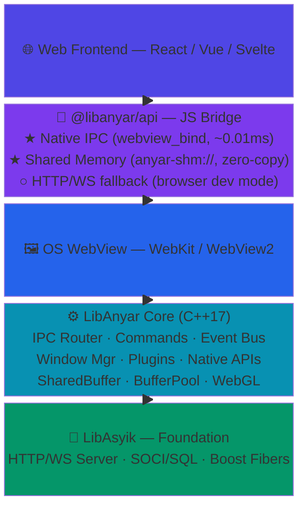
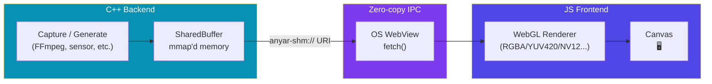

# LibAnyar

[](https://dl.circleci.com/status-badge/redirect/gh/okyfirmansyah/libanyar/tree/main)

> **Anyar** (Indonesian/Javanese) — "new", "fresh", "modern"

A lightweight C++ desktop application framework that leverages web frontend technologies (React, Vue, Svelte) for rich UI — inspired by Tauri's architecture, powered by [LibAsyik](https://github.com/okyfirmansyah/libasyik)'s fiber-based C++ runtime.

## Why LibAnyar?

Building desktop apps shouldn't force a choice between powerful native performance and a modern, rich UI. LibAnyar bridges that gap — write your backend in C++ with full access to the native ecosystem, while crafting your interface with React, Vue, or any web framework you already know.

| | Qt | Electron | Tauri | **LibAnyar** |
|---|---|---|---|---|
| UI Technology | QML/Widgets | Web (Chromium) | Web (OS WebView) | Web (OS WebView) |
| Backend Language | C++ | JavaScript | Rust | **C++** |
| Binary Size | ~15MB | ~150MB+ | ~3-5MB | **~3-8MB** |
| RAM Usage | ~30MB | ~200MB+ | ~20MB | **~20MB** |
| C/C++ Ecosystem | Native | Via N-API | Via FFI | **Native** |
| Built-in DB | — | — | Plugin | **SQLite+PostgreSQL** |
| Native IPC | Custom | — | webview msg | **webview_bind** |
| IPC HTTP/WS Fallback | — | — | — | **Built-in** |
| Zero-copy Binary IPC | — | — | — | **Shared Memory** |
| WebGL Canvas Rendering | Native OpenGL | Manual | Manual | **Built-in (RGB and YUV formats supported)** |

## Example Projects

<table>
<tr>
<td width="50%" align="center">
<h3>Hello World</h3>
<br/>
<sub>Minimal example — IPC commands, events, and built-in plugins.</sub>
</td>
<td width="50%" align="center">
<h3>Local Video Player</h3>
<br/>
<sub>FFmpeg-powered with zero-copy IPC and direct WebGL rendering.</sub>
</td>
</tr>
<tr>
<td width="50%" align="center">
<h3>Secure Key Storage</h3>
<br/>
<sub>Encrypted password manager — AES-256-GCM, multi-window, custom plugin.</sub>
</td>
<td width="50%" align="center">
<h3>Wifi Analyzer</h3>
<br/>
<sub>Real-time signal strength visualization and channel scanning.</sub>
</td>
</tr>
</table>

## Architecture



## Quick Start

> [!TIP]
> **Start a new project** — scaffold with the Anyar CLI:
> ```bash
> anyar init my-app          # interactive: pick template (React, Vue, Svelte)
> cd my-app && anyar dev     # start Vite HMR + C++ backend
> ```

**C++ backend** — define commands and manage windows:

```cpp
#include <anyar/app.h>

int main() {
    anyar::App app;

    app.command("greet", [](const json& args) -> json {
        return {{"message", "Hello, " + args["name"].get<std::string>() + "!"}};
    });

    app.create_window({
        .title = "My App",
        .width = 1024,
        .height = 768,
    });

    return app.run();
}
```

**JS frontend** — call into C++ from React, Vue, or vanilla JS:

```tsx
import { invoke } from '@libanyar/api';

const result = await invoke('greet', { name: 'World' });
// → { message: "Hello, World!" }
```

## Building

### Requirements

- C++17 compiler (GCC 11+, Clang 10+, MSVC 2019+)
- CMake >= 3.16
- LibAsyik 1.5+ (with Boost >= 1.81, SOCI 4.0.3)
- WebKitGTK 4.0 (Linux) / WebView2 (Windows) / WebKit (macOS)
- nlohmann/json >= 3.11
- Node.js >= 18 (for frontend build, optional for pre-built dist)

### Build from Source

```bash
git clone https://github.com/user/libanyar.git
cd libanyar

# Install dependencies (Ubuntu 22.04)
sudo bash scripts/setup-ubuntu.sh

# Build
mkdir build && cd build
cmake .. -DCMAKE_BUILD_TYPE=Debug -DANYAR_ENABLE_SOCI=OFF
make -j$(nproc)

# Run hello-world example
cd examples/hello-world
./hello_world
```

## Shared Memory IPC & WebGL Canvas

LibAnyar provides **zero-copy binary data transfer** between C++ and the webview frontend — ideal for video frames, LiDAR point clouds, image processing, or any large binary payload.



| Feature | Description |
|---|---|
| `@libanyar/api/buffer` | Shared memory buffers with `anyar-shm://` custom URI scheme |
| `@libanyar/api/canvas` | WebGL frame renderer (RGBA, RGB, BGRA, Grayscale, YUV420, NV12, NV21) |
| `SharedBufferPool` | Lock-free ring buffer pool for streaming (e.g. 30fps video) |
| Zero-copy | C++ writes to mmap'd memory → JS reads via `fetch()` — no serialization |

```cpp
// C++ — write pixels into shared memory
auto buf = anyar::SharedBuffer::create("frame", width * height * 4);
std::memcpy(buf->data(), pixels, buf->size());
app.emit("buffer:ready", {{"name", "frame"}, {"url", "anyar-shm://frame"}});
```

```ts
// JS — fetch and render with WebGL (zero-copy on Linux)
import { createBufferRenderer } from '@libanyar/api/canvas';

const { destroy } = createBufferRenderer({
  canvas: '#viewport',
  width: 1920, height: 1080,
  format: 'rgba',
  pool: 'video-frames',
});
```

See the [Shared Memory & WebGL Guide](docs/shared-memory-webgl.md) for full API reference.

## Documentation

Guides, API references, and tutorials: **[LibAnyar Documentation](docs/README.md)**

## License

MIT
