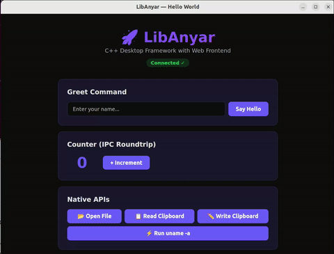
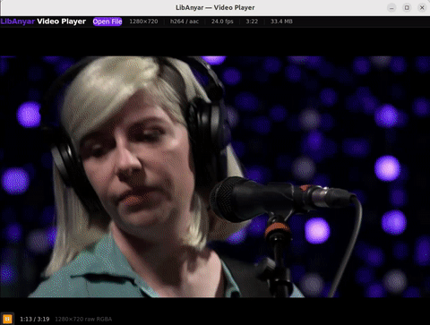
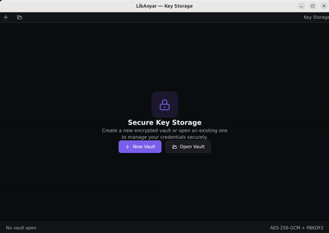

# LibAnyar

> **Anyar** (Indonesian/Javanese) — "new", "fresh", "modern"

A lightweight C++ desktop application framework that leverages web frontend technologies (React, Vue, Svelte) for rich UI — inspired by Tauri's architecture, powered by [LibAsyik](https://github.com/okyfirmansyah/libasyik)'s fiber-based C++ runtime.

## Why LibAnyar?

| | Qt | Electron | Tauri | **LibAnyar** |
|---|---|---|---|---|
| UI Technology | QML/Widgets | Web (Chromium) | Web (OS WebView) | Web (OS WebView) |
| Backend Language | C++ | JavaScript | Rust | **C++** |
| Binary Size | ~15MB | ~150MB+ | ~3-5MB | **~3-8MB** |
| RAM Usage | ~30MB | ~200MB+ | ~20MB | **~20MB** |
| C++ Ecosystem | ✅ Native | ❌ Via N-API | ❌ Via FFI | ✅ **Native** |
| Built-in DB | ❌ | ❌ | ❌ Plugin | ✅ **SQLite+PostgreSQL** |
| Native IPC | Custom | ❌ | ✅ webview msg | ✅ **webview_bind** |
| HTTP/WS Fallback | ❌ | ❌ | ❌ | ✅ **Built-in** |
| Zero-copy Binary IPC | ❌ | ❌ | ❌ | ✅ **Shared Memory** |

## Architecture

```
┌─────────────────────────────────────────┐
│         Web Frontend (React/Vue)        │
├─────────────────────────────────────────┤
│    @libanyar/api  (JS Bridge)           │
│  ★ Native IPC (webview_bind, ~0.01ms)  │
│  ★ Shared Memory (anyar-shm://, 0-copy)│
│  ○ HTTP/WS fallback (browser dev mode) │
├─────────────────────────────────────────┤
│      OS WebView (WebKit/WebView2)       │
├─────────────────────────────────────────┤
│         LibAnyar Core (C++17)           │
│   IPC Router │ Commands │ Event Bus     │
│   Window Mgr │ Plugins  │ Native APIs   │
│   SharedBuffer │ BufferPool │ WebGL     │
├─────────────────────────────────────────┤
│        LibAsyik (Foundation)            │
│  HTTP/WS Server │ SOCI/SQL │ Fibers    │
└─────────────────────────────────────────┘
```

## Quick Start

```cpp
#include <anyar/app.h>

int main() {
    anyar::App app;

    app.command("greet", [](const json& args) -> json {
        return {{"message", "Hello, " + args["name"].get<std::string>() + "!"}};
    });

    app.create_window({
        .title = "My App",
        .width = 1024,
        .height = 768,
    });

    return app.run();
}
```

```tsx
import { invoke } from '@libanyar/api';

const result = await invoke('greet', { name: 'World' });
// → { message: "Hello, World!" }
```

## Building

### Requirements

- C++17 compiler (GCC 11+, Clang 10+, MSVC 2019+)
- CMake >= 3.16
- LibAsyik 1.5+ (with Boost >= 1.81, SOCI 4.0.3)
- WebKitGTK 4.0 (Linux) / WebView2 (Windows) / WebKit (macOS)
- nlohmann/json >= 3.11
- Node.js >= 18 (for frontend build, optional for pre-built dist)

### Build from Source

```bash
git clone https://github.com/user/libanyar.git
cd libanyar

# Install dependencies (Ubuntu 22.04)
sudo bash scripts/setup-ubuntu.sh

# Build
mkdir build && cd build
cmake .. -DCMAKE_BUILD_TYPE=Debug -DANYAR_ENABLE_SOCI=OFF
make -j$(nproc)

# Run hello-world example
cd examples/hello-world
./hello_world
```

## Shared Memory IPC & WebGL Canvas

LibAnyar provides **zero-copy binary data transfer** between C++ and the webview frontend — ideal for video frames, LiDAR point clouds, image processing, or any large binary payload.

| Feature | Description |
|---|---|
| `@libanyar/api/buffer` | Shared memory buffers with `anyar-shm://` custom URI scheme |
| `@libanyar/api/canvas` | WebGL frame renderer (RGBA, RGB, BGRA, Grayscale, YUV420, NV12, NV21) |
| `SharedBufferPool` | Lock-free ring buffer pool for streaming (e.g. 30fps video) |
| Zero-copy | C++ writes to mmap'd memory → JS reads via `fetch()` — no serialization |

```cpp
// C++ — write pixels into shared memory
auto buf = anyar::SharedBuffer::create("frame", width * height * 4);
std::memcpy(buf->data(), pixels, buf->size());
app.emit("buffer:ready", {{"name", "frame"}, {"url", "anyar-shm://frame"}});
```

```ts
// JS — fetch and render with WebGL (zero-copy on Linux)
import { createBufferRenderer } from '@libanyar/api/canvas';

const { destroy } = createBufferRenderer({
  canvas: '#viewport',
  width: 1920, height: 1080,
  format: 'rgba',
  pool: 'video-frames',
});
```

See the [Shared Memory & WebGL Guide](docs/shared-memory-webgl.md) for full API reference.

## Project Status

✅ **Phase 1** — Core prototype (Linux): HTTP/WS server, webview, IPC, event bus, plugin infrastructure
✅ **Phase 2** — `@libanyar/api` TypeScript bridge: invoke, listen, emit, React hooks, module APIs
✅ **Phase 3** — Native APIs & plugins: file system, dialogs (GTK3), shell/subprocess, clipboard
✅ **Phase 4** — Database integration: SQLite & PostgreSQL via LibAsyik SOCI pool, parameterized queries, transactions
✅ **Phase 4f** — Shared Memory IPC & WebGL Canvas: zero-copy binary transfer, buffer pools, RGBA/YUV420 rendering

See [PLAN.md](PLAN.md) for full roadmap.

## Example Projects

### Hello World

A minimal example showing IPC commands, events, and built-in plugins.

<p align="center">
  
</p>

### Local Video Player

FFmpeg-powered video player with WebSocket streaming and Canvas rendering.

<p align="center">
  
</p>

### Secure Key Storage

Encrypted password manager with AES-256-GCM, multi-window modal dialogs, and a custom plugin.

<p align="center">
  
</p>

## License

MIT
